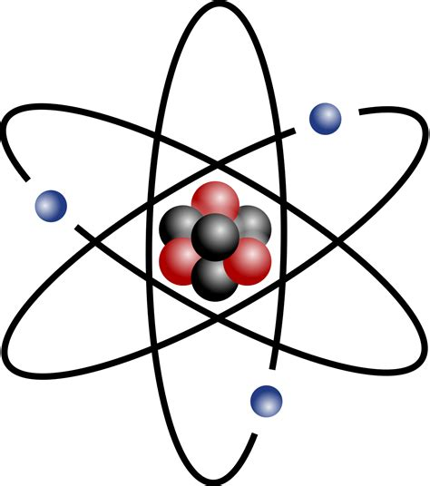

# Atomic splitter: A small django app connected to a servlerless API for molecule decomposition

Atomic splitter is made up of a serverless backend hosted on aws, which source code can be found in this repository, and a django frontend deployed on Heroku (https://dashboard.heroku.com/) at the following adress : https://intense-basin-05890.herokuapp.com/polls/detail/   

The source code for the django web app can be found here: https://github.com/benblc/django_atomic_splitter.

## Testing:

To try a simple request to the api:

#### In command line:
`curl -X POST --data "H2O" https://dwptzvjyoj.execute-api.us-east-1.amazonaws.com/dev/main`

#### In python:
`import request`   
`url = 'https://dwptzvjyoj.execute-api.us-east-1.amazonaws.com/dev/main'`   
`print(json.loads(requests.post(url, data=selected_molecule).text))`
